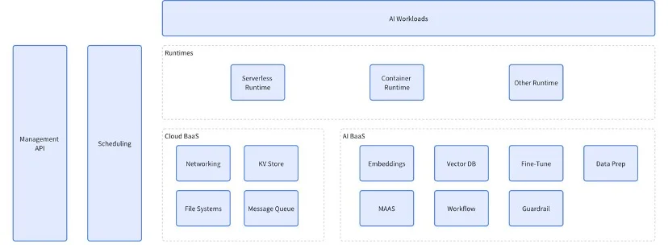


# Enhancing Developers' Jobs with AI: Bridging the Gap with AI-for-Developers

## Introduction

The world of software development is changing rapidly, and integrating AI into DevOps practices is leading this transformation. Our AI-for-Developers initiative combines the robustness of traditional development methodologies with the groundbreaking capabilities of AI. This drives automation, predictive analytics, and intelligent decision-making to new heights.

## Understanding DevOps and the Transition to AI-Enhanced Platforms

DevOps is a transformative methodology that merges software development and IT operations to foster collaboration, streamline workflows, and enhance the efficiency of the software development lifecycle. For developers, DevOps means dismantling traditional barriers between development and operations, cultivating a culture of collaboration, and ensuring smooth communication. This results in faster deployments, quicker feedback loops, and a more agile response to changes and issues, allowing developers to focus on writing code and delivering high-quality software efficiently.

Key practices in DevOps include [Infrastructure as Code (IaC)](https://aws.amazon.com/infrastructure-as-code/), [automated testing](https://www.selenium.dev/), and [Continuous Integration and Continuous Delivery (CI/CD)](https://about.gitlab.com/topics/ci-cd/). Tools like [Jenkins](https://www.jenkins.io/), [Docker](https://www.docker.com/), [Kubernetes](https://kubernetes.io/), and [Prometheus](https://prometheus.io/) are essential in automating repetitive tasks and implementing robust monitoring systems.

With the advent of AI, these traditional tools are being enhanced to provide even greater value. AI-powered platforms integrate seamlessly with existing DevOps tools, offering advanced features like intelligent automation, predictive analytics, and enhanced decision-making capabilities. These platforms help developers by providing deeper insights, automating more complex tasks, and predicting potential issues before they arise. This enhancement facilitates a smoother transition from traditional DevOps practices to more advanced, AI-driven workflows, ultimately increasing efficiency and reducing the cognitive load on developers.

## The Limitations of Current AI-Assisted Tools for Developers

While AI integration in development has introduced advanced tools like [AWS CodeGuru](https://aws.amazon.com/codeguru/), Datadog APM, [Sysdig](https://sysdig.com/), and [Moogsoft AIOps](https://www.moogsoft.com/), these tools face several limitations. Traditional tools struggle with the complexity and volume of data in modern IT environments, often relying on predefined rules and scripts that limit their flexibility. Moreover, integrating AI into existing workflows requires significant investment in new tools, skills, and infrastructure changes, posing a challenge for many organizations. These limitations can hinder the full potential of AI in transforming development practices, making it essential to find more seamless integration methods.

## Bridging the Gap with AI-for-Developers

AI-for-Developers aims to bridge these gaps by combining the strengths of traditional development practices with the transformative power of AI. This approach enhances traditional workflows with real-time data analysis, proactive issue detection, and adaptive response mechanisms, making development processes more flexible and efficient. AI-for-Developers empowers teams with smarter monitoring systems and automated problem resolution tools, minimizing downtime and enhancing system reliability.

## A User-Centric Approach

At the heart of AI-for-Developers is a commitment to user-centric design. Our tools prioritize the needs, routines, and preferences of developers and operators, ensuring they are both intuitive and effective. We believe that the best way to enhance developer productivity and satisfaction is to create tools that seamlessly integrate into their existing workflows and reduce friction points.

Our development process involves continuous feedback loops with end-users to ensure that the tools we build meet their evolving needs. This iterative process includes regular usability testing sessions, where real developers interact with the tools and provide invaluable insights into their functionality and user experience. These sessions help us identify pain points and areas for improvement, which are then addressed in subsequent iterations.

By prioritizing the user experience and continuously iterating based on developer feedback, AI-for-Developers creates tools that are not only powerful but also a joy to use. This commitment to user-centric design ensures that our solutions align closely with user expectations, enhancing productivity and reducing frustration across development teams.

## Leveraging the InfiniEdge AI Project to Enhance AI Workloads

The AI-for-Developers initiative leverages the capabilities of the **InfiniEdge AI project** (https://lfedge.org/projects/infiniedge-ai/) to provide an edge-cloud continuum serverless platform. This platform enables flexible scheduling of AI workloads across edge clusters and data centers, dynamically adjusting based on network conditions and performance preferences. By utilizing the InfiniEdge AI project, AI-for-Developers ensures rapid startup times and efficient scaling, adapting seamlessly to varying workload demands.

InfiniEdge AI also offers an AI framework that simplifies the implementation of various AI workloads, such as AI agents. This framework reduces the complexity for AI engineers and allows developers with limited AI expertise to create their own AI tools, thereby improving overall developer productivity. The serverless nature of InfiniEdge AI means that resources are allocated and managed optimally, ensuring high performance and reliability.

Moreover, the InfiniEdge AI project supports advanced AI models and applications by providing robust tools for managing and orchestrating AI workloads. Developers can deploy sophisticated machine learning models, deep learning frameworks, and other AI-driven applications without worrying about the underlying infrastructure. InfiniEdge AI’s adaptive resource management ensures that AI workloads are dynamically scaled and distributed, optimizing both cost and performance.

The integration with InfiniEdge AI also enhances data security and compliance, as it allows sensitive data to be processed locally at the edge, reducing the need for data transfer over potentially vulnerable networks. This approach aligns with stringent data protection regulations and ensures that AI applications maintain high standards of privacy and security.

Overall, leveraging the InfiniEdge AI project within the AI-for-Developers framework offers a comprehensive, flexible, and efficient solution for managing AI workloads. It empowers developers to harness the full potential of AI technologies, enhancing productivity and innovation across the software development lifecycle.

## General Architecture of the InfiniEdge AI Serverless Framework

The InfiniEdge AI serverless framework provides a robust and flexible environment for managing AI workloads, comprising several key components.

The architecture includes various runtimes like Serverless Runtime for executing AI workloads without managing infrastructure, Container Runtime for greater control and isolation, and Other Runtime for specific use cases.

Cloud BaaS (Backend as a Service) supports AI operations with essential services such as Networking for communication, KV Store for quick access to data, File Systems for storage, and Message Queue for efficient processing.

AI BaaS (Backend as a Service) offers specialized AI services including Embeddings for data embedding, Vector DB for querying vector data, Fine-Tune for model adjustments, Data Prep for preprocessing data, MAAS for deploying AI models, Workflow for orchestrating tasks, and Guardrail for safety and compliance.

The Management API oversees resource management and deployments, while the Scheduling component ensures optimal workload allocation.

This architecture ensures a comprehensive, flexible, and efficient solution for managing AI workloads, empowering developers to fully leverage AI technologies.

## Conclusion

By adopting AI-for-Developers, organizations can overcome the limitations of traditional development practices, achieving a more agile, resilient, and efficient development process. This approach not only enhances automation and scalability but also ensures systems remain adaptive to changing user needs and business requirements. Ultimately, AI-for-Developers transforms how organizations build, deploy, and manage software, fostering a culture of continuous improvement and agility.

In summary, AI-for-Developers represents a significant advancement in software development. By addressing the limitations of current AI-assisted tools and embracing a user-centric approach within an edge-cloud continuum platform, AI-for-Developers is set to revolutionize the development, deployment, and management of software, promoting a future of continuous improvement and agility.

## Call to Action

- Join our InfiniEdge AI project community and make contributions. Be part of a dynamic team working on cutting-edge AI and edge-cloud continuum solutions. Your expertise can help us push the boundaries of what’s possible in AI-enhanced DevOps. InfiniEdge AI is revolutionizing how AI is deployed, focusing on real-time decision-making, enhanced security, and lower costs. Get involved and make an impact today! To get more details, visit the [InfiniEdge AI project page](https://lfedge.org/projects/infiniedge-ai/).
- The AI-for-Developers meeting has concluded, featuring insightful discussions on real-time AI applications, security and privacy, and resource optimization. If you missed the event or want to revisit the sessions, the recording is now available at [AI-for-Developers Meeting - LF Edge and LF AI & Data](https://lf-edge.atlassian.net/wiki/spaces/IA/pages/13566413/AI+for+Developers+Meeting+LF+Edge+and+LF+AI+Data). This is a great opportunity to catch up on the latest developments, learn from expert speakers, and explore cutting-edge AI technologies that are shaping the future of development.

